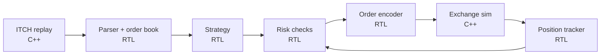

# FPGA Tick-to-Trade

A from-scratch, FPGA-based low-latency trading pipeline built on Nasdaq's public exchange protocols. It parses the TotalView-ITCH 5.0 market data feed in RTL, maintains an order book in hardware, runs a simple strategy with pre-trade risk checks, and emits orders in OUCH 5.0 format, all verified in a C++/Verilator closed-loop simulation against a simulated exchange.

## Goals

- Build the core blocks of an FPGA trading system: feed parser, order book, strategy, risk checks, order encoder, and position tracker.
- Measure and document latency for every stage, in nanoseconds, with clearly defined start and end points.
- Verify everything against C++ golden models using real Nasdaq historical data, with randomized backpressure and formal proofs on control logic.
- Close the loop in simulation: replay real market data, trade against a simulated exchange, and track P&L.
- Eventually move to hardware: real packets over 10G Ethernet into a physical FPGA board.

## Architecture



The RTL blocks form the "FPGA." The C++ blocks model the outside world: the ITCH replay stands in for Nasdaq's market data feed, and the exchange simulator stands in for Nasdaq's matching engine.

## Roadmap

| Stage | Component | Flow | Status |
|---|---|---|---|
| 1 | ITCH 5.0 parser | model → dump app → tb → RTL | ◐ In progress |
| 2 | Order book (best bid/offer output) | model → tb → RTL | ☐ Not started |
| 3 | ITCH replay source | C++ app | ☐ Not started |
| 4 | Exchange simulator + fill model + P&L | C++ model | ☐ Not started |
| 5 | Reference trading loop (strategy, risk, encoder, tracker) | C++ models, closed loop | ☐ Not started |
| 6 | Strategy | swap C++ → RTL, diff trades | ☐ Not started |
| 7 | Pre-trade risk checks | swap C++ → RTL + formal | ☐ Not started |
| 8 | OUCH order encoder | swap C++ → RTL, diff bytes | ☐ Not started |
| 9 | Position tracker | swap C++ → RTL, diff trades | ☐ Not started |
| 10 | Latency-aware simulation timing model | C++ | ☐ Not started |
| 11 | Hardware bring-up (UDP/MoldUDP64, 10G, board) | RTL + board | ☐ Future |

### Flow

Every block goes through the same steps:

1. **Model** (`model/`): C++ reference written from the spec, not from the RTL. Integer math only, deterministic, seeded.
2. **Check the model** against real data (`apps/`), and against a third-party implementation where one exists.
3. **Testbench** (`tb/<block>/`): drives the same bytes into the RTL and the model; the scoreboard compares outputs field by field under random `tvalid`/`tready` gaps.
4. **RTL** (`rtl/`): built up one feature at a time until the scoreboard is clean on the sample day.
5. **Formal** (`formal/`) where the block is control-heavy.
6. **Timing**: `make synth` at 156.25 MHz before calling the block done.
7. **Swap** into the closed loop: the trades must match the pure C++ run exactly.

### Known challenges

**Cross-cutting**
- **Byte order.** ITCH is big-endian, x86 is little-endian, and AXI-Stream puts the first byte in `tdata[7:0]`. The driver, the model and the RTL must all agree; this causes most early mismatches.
- **Sim speed.** A full day is hundreds of millions of messages, and Verilator runs at a few million cycles per second. Regressions run on samples and a filtered set of symbols; full days run overnight.
- **Locate codes change daily.** Build the symbol filter from the Stock Directory (`R`) messages at the start of each day, not from a hardcoded table.
- **Bit-exact C++ vs RTL.** No floating point anywhere in the decision path. Tie-breaks and update order must be defined identically in both.

**1. Parser**
- **Unaligned messages.** Messages are 14 to 50+ bytes including the length prefix, so they start and end mid-beat, and one 8-byte beat can hold the end of one message and the start of the next. The byte-shift/realign mux is the timing-critical path.
- **The wire can't be backpressured.** Random `tready` is good for testing, but in hardware the parser must take one beat per cycle forever, including at the 9:30 open burst.
- **Cut-through.** The latency target counts from the last *required* byte, so fields can be emitted before the message ends.
- **Framing.** Sample files and MoldUDP64 both use a 2-byte length before each message; parsing that format from day one makes the hardware stage easier.

**2. Order book** (likely the hardest block)
- **Lookups by order ref only.** Execute, Cancel, Delete and Replace carry only the order reference number, not price, side or symbol, so the book needs an `order_ref → (locate, side, price, shares)` table. Millions of orders are live per day and the refs are 64-bit, so this won't fit on-chip for the whole market. Symbol filtering plus hashing or direct indexing is required, along with a plan for collisions.
- **Finding the next best price.** When the best level empties, the next one has to be found. That isn't O(1) in hardware; the usual answers are a fixed price band around the market with a priority encoder, or a small sorted top-N.
- **Read-modify-write hazards.** Back-to-back messages that hit the same order or level while the BRAM read is still in flight need forwarding logic.
- **Replace (`U`)** removes one order and creates another with a new ref, which is two table operations for one message.

**3. Replay**
- The feed is extremely bursty (pre-market, the open, the close). Decide whether replay runs at recorded timestamps or as fast as possible; they test different things.

**4. Exchange simulator**
- **Your orders can't move history.** Fills are an estimate, not a fact.
- **Queue position.** A passive order joins the back of its price level and only fills after the volume ahead of it trades or cancels. Assuming an instant fill at the touch is the classic backtest lie.
- **Latency.** Filling at the price of the tick that triggered the order ignores reaction time, so stage 10 is needed before any P&L number means anything.
- **Fees and rebates** are the same size as the edge; include them from the start.

**5. Reference loop**
- Define exactly when the strategy sees the book (after every message, or after every batch that shares a timestamp). The RTL must follow the same rule or the trades will diverge.

**6. Strategy**
- Fixed-point only; avoid dividers. Ratios like book imbalance can be done as a compare of products.

**7. Risk**
- Position limits must count orders in flight (sent but not yet acknowledged or filled), not just filled position.
- Fills arriving in the same cycle as a new order: define who wins, then prove it formally.

**8. OUCH encoder**
- Most of the message can be precomputed; only price, size and token change, which keeps latency down.
- Order tokens / UserRefNum must strictly increase, even across rejects.
- In real use OUCH runs over SoupBinTCP, meaning TCP, which is hard in an FPGA (stage 11).

**9. Position tracker**
- Partial fills, cancels racing fills, and replaced orders. Must agree cycle for cycle with what risk checks against.

**10. Timing model**
- Converts RTL cycles to nanoseconds and adds modeled wire and exchange delays. Needed before stage 4 P&L numbers can be trusted.

**11. Hardware**
- **Packet loss.** MoldUDP64 has sequence numbers; a gap means lost data, which needs A/B feed arbitration and a recovery path.
- **MAC/PCS.** The 10G MAC/PCS and transceiver setup come from vendor IP; pick a board whose part is supported by the free Vivado edition.
- **Measurement.** Hardware timestamps at the ports are needed to measure wire-to-wire latency.
- **WSL2.** Vivado runs, but the board's USB/JTAG has to be forwarded into WSL with `usbipd-win`.

## Design targets

- **Datapath:** 64-bit AXI-Stream.
- **Clock:** 156.25 MHz baseline (native 10G Ethernet rate). 250 MHz stretch goal.
- **Latency:** measured from the last required input byte to valid output.
  - Parser: 1–3 cycles
  - Book update to best bid/offer: 2–4 cycles
  - Full application logic (ITCH in to OUCH out): under 20 cycles (~130 ns) initially, under 10 cycles (~64 ns) stretch
- **Timing closure:** checked in Vivado against the target part throughout development, not just at the end.

## Verification approach

- **Simulator:** Verilator, with testbenches written in C++.
- **Testbench structure:** UVM-style, but in plain C++: an AXI-Stream driver, a monitor, a scoreboard, and sequences that control backpressure patterns.
- **Golden models:** C++ reference implementations of each block, linked directly into the testbench.
- **Stimulus:** real Nasdaq historical ITCH data, replayed with randomized `tvalid`/`tready` gaps.
- **Assertions:** inline SVA in the RTL for protocol and invariant checks.
- **Formal:** SymbiYosys proofs on control-heavy blocks (framer, aligner, risk checks).
- **Waveforms:** VCD traces viewed in GTKWave or Surfer.


## Getting started

### Environment

```sh
make setup      # apt deps + OSS CAD Suite (Verilator, Yosys, SymbiYosys, solvers) + python venv into ./tools
make doctor     # verify toolchain
make sample     # download a day of PSX ITCH and cut the first 1M messages to data/sample.itch
make help       # everything else: lint, sim, waves, formal, synth, test
```

`make sim BLOCK=<module>` builds `tb/<module>/*.cpp` against the RTL top `<module>` and runs it with `+seed=` and `+itch=`. Vivado isn't installed by `make setup`; source its `settings64.sh` before running `make synth`.

### Sample data

Nasdaq hosts full-day historical ITCH files at <https://emi.nasdaq.com/ITCH/>. The sample files use a slightly different framing from the live wire format: ach message is prefixed with a 2-byte big-endian length. See the binary file format spec below.


## References

### Specifications

- [TotalView-ITCH 5.0](https://nasdaqtrader.com/content/technicalsupport/specifications/dataproducts/NQTVITCHspecification.pdf): the main market data spec. Message formats, field offsets, and lengths all come from here.
- [Binary file format](http://www.nasdaqtrader.com/content/technicalSupport/specifications/dataproducts/binaryfile.pdf): how the downloadable sample files are framed.
- [MoldUDP64](http://www.nasdaqtrader.com/content/technicalsupport/specifications/dataproducts/moldudp64.pdf): the UDP transport that wraps ITCH on the wire. 20-byte big-endian header: 10-byte session ID, 8-byte sequence number, 2-byte message count (0xFFFF = end of session).
- [OUCH 5.0](http://nasdaqtrader.com/content/technicalsupport/specifications/TradingProducts/Ouch5.0.pdf): order entry protocol. Runs over SoupBinTCP.
- [ITCH FPGA FAQ](https://Nasdaqtrader.com/content/ProductsServices/DataProducts/TotalView/FPGAITCHFAQ.pdf): background on Nasdaq's FPGA-oriented feed.
- [BX ITCH](https://m.nasdaqtrader.com/content/technicalsupport/specifications/dataproducts/BXTVITCHSpecification.pdf) and [PSX ITCH](https://m.nasdaqtrader.com/content/technicalsupport/specifications/dataproducts/PSXTVITCHSpecification.pdf): variants for Nasdaq's smaller exchanges.

### Data

- [Nasdaq sample ITCH files](https://emi.nasdaq.com/ITCH/): free full-day historical dumps (NASDAQ, BX, PSX).
- [Stock locate codes](https://emi.nasdaq.com/ITCH/Stock_Locate_Codes/): maps numeric locate IDs to ticker symbols.
- [Databento](https://databento.com/docs/venues-and-datasets/xnas-itch): paid, recent ITCH data with nanosecond timestamps.

### Reference implementations

- [ahtik/itch-order-book](https://github.com/ahtik/itch-order-book) (C++): fast order book using only vectors and arrays. Useful for thinking about hardware-friendly data structures.
- [martinobdl/ITCH](https://github.com/martinobdl/ITCH) (C++): full-depth book reconstruction with CSV output. Useful as a golden reference to diff against.
- [beshjp/itch-order-book](https://github.com/beshjp/itch-order-book) (Python): readable implementation for understanding the logic.
- [RITCH](https://github.com/DavZim/RITCH) (R/C++): maintained parser that can download sample files.

### Learning

- *Trading and Exchanges* by Larry Harris: market microstructure fundamentals.
- *Computer Arithmetic* by Behrooz Parhami: arithmetic design for the strategy and signal blocks.
- [alexforencich/verilog-ethernet](https://github.com/alexforencich/verilog-ethernet): reference for the network stack stage.

## Glossary

Terms from the trading world, for readers.

- **ITCH:** Nasdaq's outbound market data protocol. Reports every order added, changed, executed, or removed from the book.
- **OUCH:** Nasdaq's order entry protocol. How a trader sends, modifies, and cancels orders.
- **MoldUDP64 / SoupBinTCP:** Transport layers for ITCH (UDP multicast) and OUCH (TCP), respectively.
- **Order book:** The set of all resting buy (bid) and sell (ask/offer) orders for a security, organized by price.
- **BBO (best bid and offer):** The highest bid and lowest ask price currently in the book. Also called top of book.
- **Stock locate code:** A numeric ID Nasdaq assigns to each security for the day, used instead of the ticker in most messages.
- **Order reference number:** A unique ID for each order in the ITCH feed, used to track it through later cancel/execute/replace messages.
- **Aggressive (taking) order:** An order that crosses the spread and executes immediately against resting orders.
- **Passive (resting) order:** An order that sits in the book waiting to be matched.
- **Queue position:** Where a resting order sits among others at the same price. Earlier orders fill first.
- **Tick-to-trade:** Latency from receiving a market data update to sending an order in response.
- **Wire-to-wire:** Tick-to-trade measured at the physical network ports, including the Ethernet layers.
- **Pre-trade risk checks:** Hard limits every order must pass before leaving the system (max size, max position, price collars, rate limits, kill switch).
- **Fat-finger check / price collar:** Rejecting orders priced unreasonably far from the current market.
