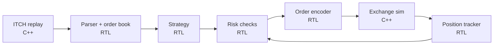

# FPGA Tick-to-Trade

A from-scratch, FPGA-based low-latency trading pipeline built on Nasdaq's public exchange protocols. It parses the TotalView-ITCH 5.0 market data feed in RTL, maintains an order book in hardware, runs a simple strategy with pre-trade risk checks, and emits orders in OUCH 5.0 format, all verified in a C++/Verilator closed-loop simulation against a simulated exchange.

## Goals

- Build the core blocks of an FPGA trading system: feed parser, order book, strategy, risk checks, order encoder, and position tracker.
- Measure and document latency for every stage, in nanoseconds, with clearly defined start and end points.
- Verify everything against C++ golden models using real Nasdaq historical data, with randomized backpressure and formal proofs on control logic.
- Close the loop in simulation: replay real market data, trade against a simulated exchange, and track P&L.
- Eventually move to hardware: real packets over 10G Ethernet into a physical FPGA board.

## Architecture

The RTL blocks form the "FPGA." The C++ blocks model the outside world: the ITCH replay stands in for Nasdaq's market data feed, and the exchange simulator stands in for Nasdaq's matching engine.

## Roadmap

| Stage | Component | Type | Status |
|---|---|---|---|
| 1 | ITCH 5.0 parser | RTL + C++ golden model | ☐ Not started |
| 2 | Order book (best bid/offer output) | RTL + C++ golden model | ☐ Not started |
| 3 | ITCH replay source | C++ | ☐ Not started |
| 4 | Exchange simulator + fill model + P&L | C++ | ☐ Not started |
| 5 | Reference trading loop (strategy, risk, encoder, tracker) | C++ | ☐ Not started |
| 6 | Strategy | RTL | ☐ Not started |
| 7 | Pre-trade risk checks | RTL + formal | ☐ Not started |
| 8 | OUCH order encoder | RTL | ☐ Not started |
| 9 | Position tracker | RTL | ☐ Not started |
| 10 | Latency-aware simulation timing model | C++ | ☐ Not started |
| 11 | Hardware bring-up (UDP/MoldUDP64, 10G, board) | RTL + board | ☐ Future |

Each RTL block replaces its C++ counterpart one at a time. After each swap, the closed-loop run must produce trades identical to the pure C++ run.

## Design targets

- **Datapath:** 64-bit AXI-Stream.
- **Clock:** 156.25 MHz baseline (native 10G Ethernet rate). 250 MHz stretch goal.
- **Latency:** measured from the last required input byte to valid output.
  - Parser: 1–3 cycles
  - Book update to best bid/offer: 2–4 cycles
  - Full application logic (ITCH in to OUCH out): under 20 cycles (~130 ns) initially, under 10 cycles (~64 ns) stretch
- **Timing closure:** checked in Vivado against the target part throughout development, not just at the end.

## Verification approach

- **Simulator:** Verilator, with testbenches written in C++.
- **Testbench structure:** UVM-style, but in plain C++: an AXI-Stream driver, a monitor, a scoreboard, and sequences that control backpressure patterns.
- **Golden models:** C++ reference implementations of each block, linked directly into the testbench.
- **Stimulus:** real Nasdaq historical ITCH data, replayed with randomized `tvalid`/`tready` gaps.
- **Assertions:** inline SVA in the RTL for protocol and invariant checks.
- **Formal:** SymbiYosys proofs on control-heavy blocks (framer, aligner, risk checks).
- **Waveforms:** VCD traces viewed in GTKWave or Surfer.

## Getting started

### Sample data

Nasdaq hosts full-day historical ITCH files at <https://emi.nasdaq.com/ITCH/>. The sample files use a slightly different framing from the live wire format: ach message is prefixed with a 2-byte big-endian length. See the binary file format spec below.

## References

### Specifications

- [TotalView-ITCH 5.0](https://nasdaqtrader.com/content/technicalsupport/specifications/dataproducts/NQTVITCHspecification.pdf): the main market data spec. Message formats, field offsets, and lengths all come from here.
- [Binary file format](http://www.nasdaqtrader.com/content/technicalSupport/specifications/dataproducts/binaryfile.pdf): how the downloadable sample files are framed.
- [MoldUDP64](http://www.nasdaqtrader.com/content/technicalsupport/specifications/dataproducts/moldudp64.pdf): the UDP transport that wraps ITCH on the wire. 20-byte big-endian header: 10-byte session ID, 8-byte sequence number, 2-byte message count (0xFFFF = end of session).
- [OUCH 5.0](http://nasdaqtrader.com/content/technicalsupport/specifications/TradingProducts/Ouch5.0.pdf): order entry protocol. Runs over SoupBinTCP.
- [ITCH FPGA FAQ](https://Nasdaqtrader.com/content/ProductsServices/DataProducts/TotalView/FPGAITCHFAQ.pdf): background on Nasdaq's FPGA-oriented feed.
- [BX ITCH](https://m.nasdaqtrader.com/content/technicalsupport/specifications/dataproducts/BXTVITCHSpecification.pdf) and [PSX ITCH](https://m.nasdaqtrader.com/content/technicalsupport/specifications/dataproducts/PSXTVITCHSpecification.pdf): variants for Nasdaq's smaller exchanges.

### Data

- [Nasdaq sample ITCH files](https://emi.nasdaq.com/ITCH/): free full-day historical dumps (NASDAQ, BX, PSX).
- [Stock locate codes](https://emi.nasdaq.com/ITCH/Stock_Locate_Codes/): maps numeric locate IDs to ticker symbols.
- [Databento](https://databento.com/docs/venues-and-datasets/xnas-itch): paid, recent ITCH data with nanosecond timestamps.

### Reference implementations

- [ahtik/itch-order-book](https://github.com/ahtik/itch-order-book) (C++): fast order book using only vectors and arrays. Useful for thinking about hardware-friendly data structures.
- [martinobdl/ITCH](https://github.com/martinobdl/ITCH) (C++): full-depth book reconstruction with CSV output. Useful as a golden reference to diff against.
- [beshjp/itch-order-book](https://github.com/beshjp/itch-order-book) (Python): readable implementation for understanding the logic.
- [RITCH](https://github.com/DavZim/RITCH) (R/C++): maintained parser that can download sample files.

### Learning

- *Trading and Exchanges* by Larry Harris: market microstructure fundamentals.
- *Computer Arithmetic* by Behrooz Parhami: arithmetic design for the strategy and signal blocks.
- [alexforencich/verilog-ethernet](https://github.com/alexforencich/verilog-ethernet): reference for the network stack stage.

## Glossary

Terms from the trading world, for readers.

- **ITCH:** Nasdaq's outbound market data protocol. Reports every order added, changed, executed, or removed from the book.
- **OUCH:** Nasdaq's order entry protocol. How a trader sends, modifies, and cancels orders.
- **MoldUDP64 / SoupBinTCP:** Transport layers for ITCH (UDP multicast) and OUCH (TCP), respectively.
- **Order book:** The set of all resting buy (bid) and sell (ask/offer) orders for a security, organized by price.
- **BBO (best bid and offer):** The highest bid and lowest ask price currently in the book. Also called top of book.
- **Stock locate code:** A numeric ID Nasdaq assigns to each security for the day, used instead of the ticker in most messages.
- **Order reference number:** A unique ID for each order in the ITCH feed, used to track it through later cancel/execute/replace messages.
- **Aggressive (taking) order:** An order that crosses the spread and executes immediately against resting orders.
- **Passive (resting) order:** An order that sits in the book waiting to be matched.
- **Queue position:** Where a resting order sits among others at the same price. Earlier orders fill first.
- **Tick-to-trade:** Latency from receiving a market data update to sending an order in response.
- **Wire-to-wire:** Tick-to-trade measured at the physical network ports, including the Ethernet layers.
- **Pre-trade risk checks:** Hard limits every order must pass before leaving the system (max size, max position, price collars, rate limits, kill switch).
- **Fat-finger check / price collar:** Rejecting orders priced unreasonably far from the current market.
